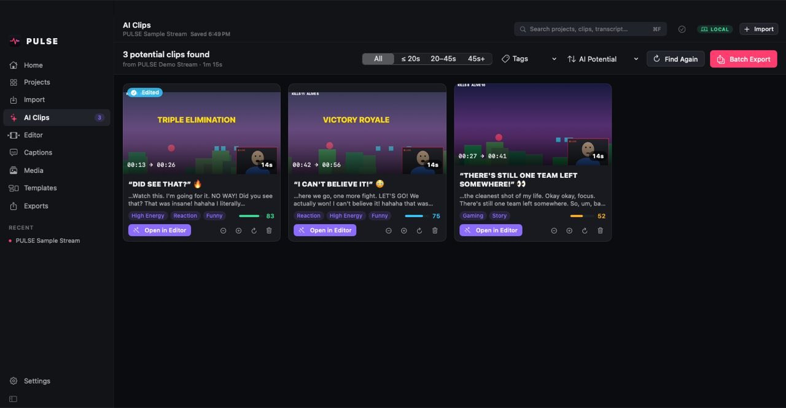
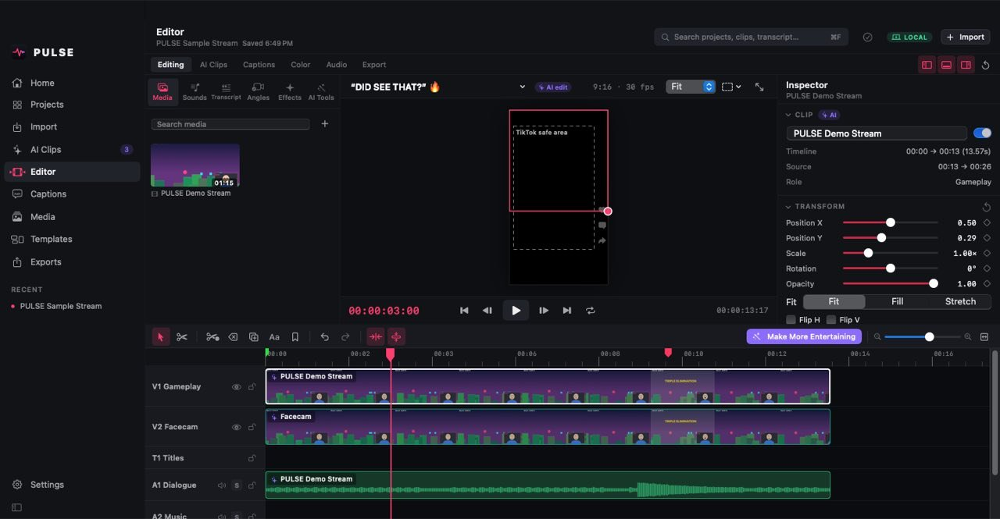
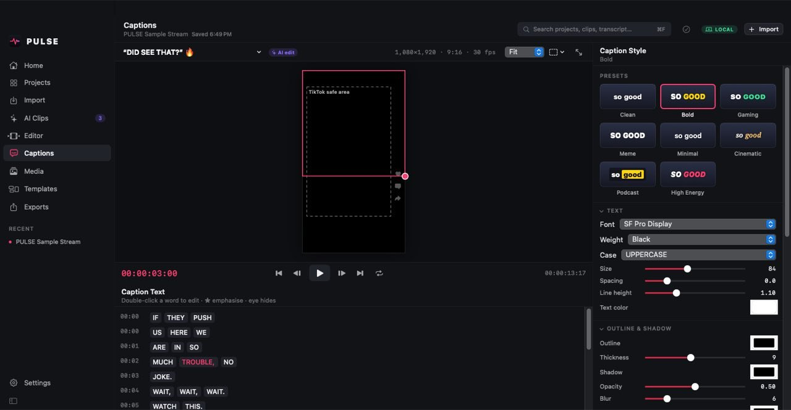
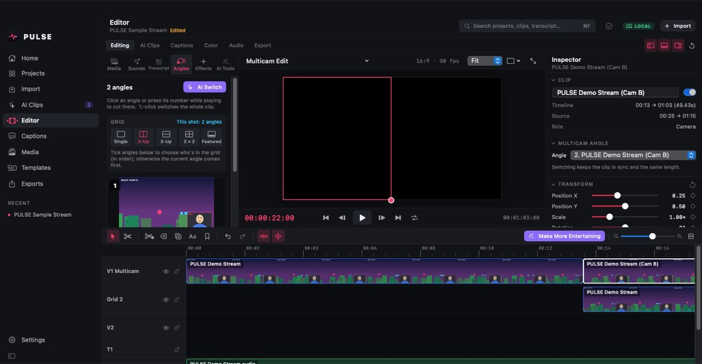
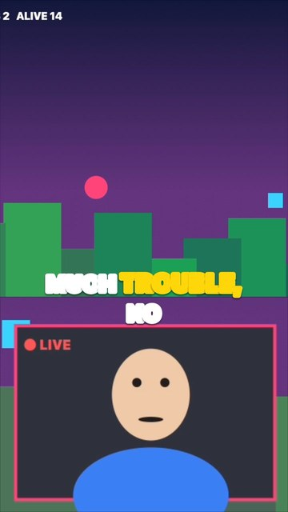
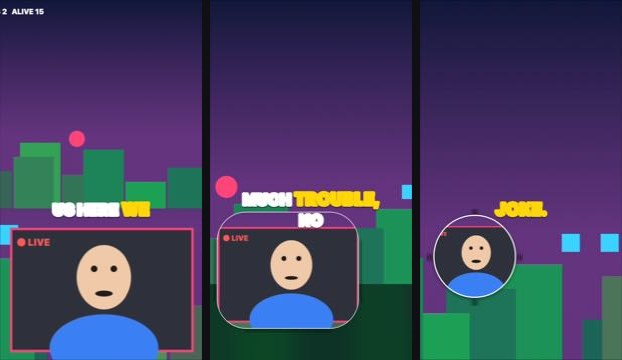

# PULSE

**AI finds the moments. AI builds the first edit. You have total control.**

PULSE is a local-first AI video clipping and short-form editor for macOS (Apple Silicon first).
Import a long stream, podcast or video. PULSE analyzes it on your Mac, finds the most entertaining
moments and builds ready-to-post vertical shorts with captions, facecam layouts and punch-ins. Every
AI decision lands on a professional timeline as normal, editable clips, keyframes and captions.

## Screenshots

These come straight from CI (`PULSE --ui-snapshots` on a GitHub macOS runner, with a generated sample
stream). The runner can't capture the live video layer, so viewers look black in the app shots; the frame
the viewer actually shows is rendered separately below.

| AI clips | Editor |
|---|---|
|  |  |
| **Captions** | **Multicam grid** |
|  |  |

| Rendered short (split screen + captions) | Layout morph: split screen → circle facecam (before / mid / after) |
|---|---|
|  |  |

## Features

- **AI clip finding.** Analyzes speech, silence, loudness spikes, scene changes and faces. Each candidate
  follows HOOK → CONTEXT → PAYOFF → END and gets an *AI Potential* score, tags, titles and hook advice.
- **One-click shorts.** Builds a 9:16 edit with a gameplay + facecam layout, AI reframing, animated
  word-level captions (8 presets), silence trimming, punch-ins and music ducking. Layouts can change mid-clip
  with smooth morphs (split screen → corner → circle facecam), placed by AI or at the playhead.
- **Make More Entertaining.** Adds jump cuts, filler-word removal, zooms and caption emphasis. The
  *Remove All AI Edits* command strips them out again.
- **Pro editor.** Multi-track timeline with trim, move, blade, ripple, snapping, a magnetic timeline,
  linked A/V, speed and markers. The inspector covers transform, crop, keyframes, text, audio, color,
  LUTs, effects and transitions (true cross-dissolves with audio crossfades).
- **Audio Enhance.** Voice preset, AI voice isolation (on-device neural noise removal) or classic noise reduction, EQ, compressor, pan, −14 LUFS loudness
  normalization and a limiter, rendered locally and non-destructively.
- **Record.** Screen or window + system audio + webcam + mic (⇧⌘R, pause with ⇧⌘P), saved as synced
  files; shorts use the webcam as the facecam and your mic for captions.
- **Multicam.** Synced cameras (or screen + webcam) in an Angles panel: press 1–9 while playing to cut,
  put 2–4 angles on screen at once (2-up, 3-up, 2×2, featured), or let AI cut to whoever is talking.
- **Compound clips.** Nest a selection into one clip (⌥G), open it to edit inside, break it apart again.
- **Speakers.** Transcripts are split into speakers on your Mac with a neural voice model (or by mic in
  multi-mic multicam sessions); rename or merge speakers in the Transcript panel. Captions can take a color
  per speaker and show name tags.
- **Music & SFX library.** 14 royalty-free tracks in 10 styles, composed on your Mac to fit your edit
  exactly, and 28 sound effects (whoosh, impact, boom, ding, rimshot, sad trombone…). AI shorts use them too.
- **Text-based editing.** Delete words in the transcript to cut them from the video, and restore them
  any time.
- **Export.** TikTok, YouTube Shorts and Reels presets, hardware H.264/HEVC or ProRes, and a batch
  export queue.
- **Privacy.** Video and audio never leave your Mac. Cloud AI is optional and only ever sees transcript
  text: Claude or any OpenAI-compatible server, including local LM Studio or Ollama. API keys live in
  the Keychain.
- **Safe by default.** Autosave, rotating backups, project versions, crash recovery and undo/redo for
  everything.

## Build & run

Requirements: macOS 14 or later (macOS 15 recommended), Xcode 16 or its command line tools.

```bash
swift run PULSE                 # launch from source
./scripts/build-app.sh          # build/PULSE.app + build/PULSE.zip (ad-hoc signed)
swift test                      # unit + engine end-to-end tests
```

You can also open `Package.swift` in Xcode, choose the **PULSE** scheme and run.

To try it without your own footage, pick **Open Sample Project** on the welcome screen. PULSE
generates a 75-second gameplay + facecam clip locally and runs the whole pipeline on it.

### Transcription

- **Apple on-device speech** needs the app bundle (`./scripts/build-app.sh`).
- **whisper.cpp:** run `brew install whisper-cpp`, then download a model in Settings → Transcription
  (or drop a ggml model into `~/Library/Application Support/PULSE/Models`). Automatic mode falls back
  to whisper.cpp when Apple Speech isn't available.
- **Or import** an SRT or VTT file.

## Project layout

```
Sources/PulseCore     models + algorithms (pure Swift, unit tested)
Sources/PulseEngine   AVFoundation / Vision / Speech / Core Image engine
Sources/PulseApp      SwiftUI app
Tests/                PulseCoreTests, PulseEngineTests (end-to-end render + export)
Resources/Models      on-device speaker model (Resemblyzer GE2E, Apache-2.0)
docs/HANDOFF.md       status, honest gaps, next steps
```
